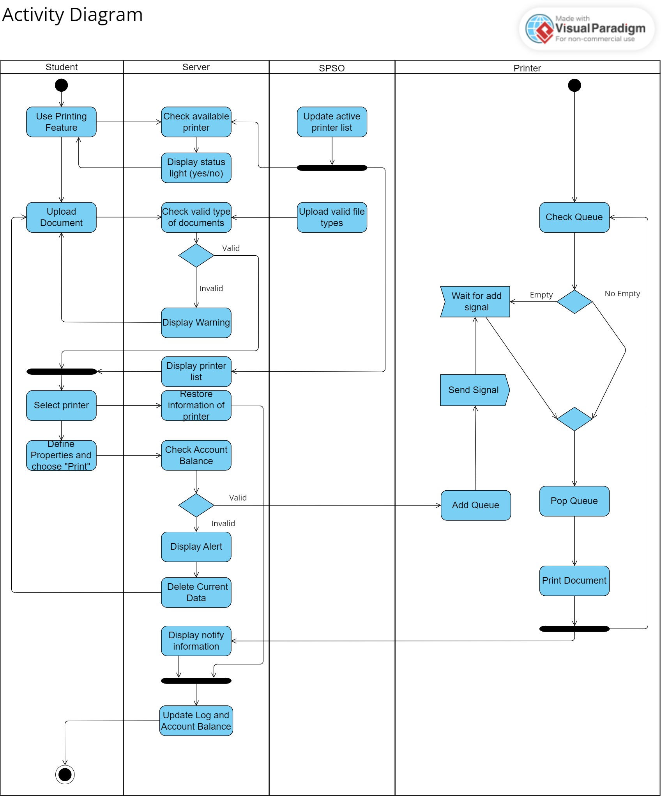
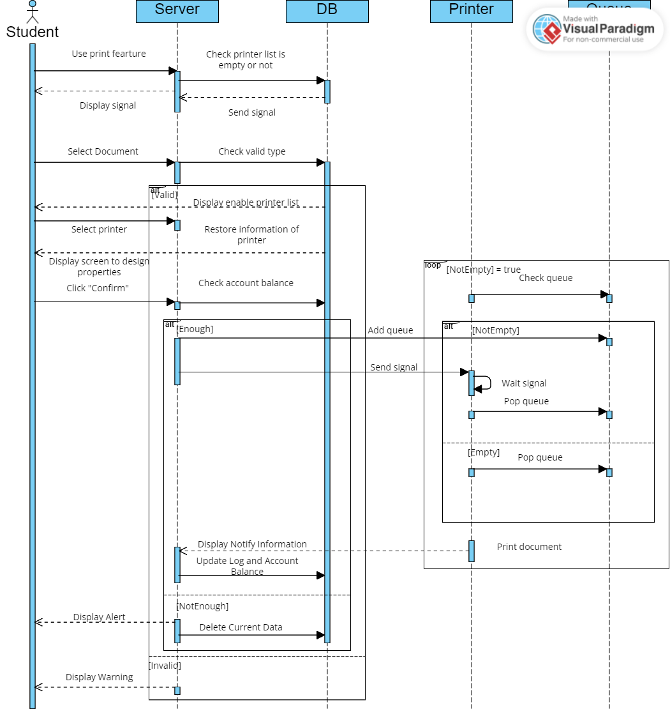
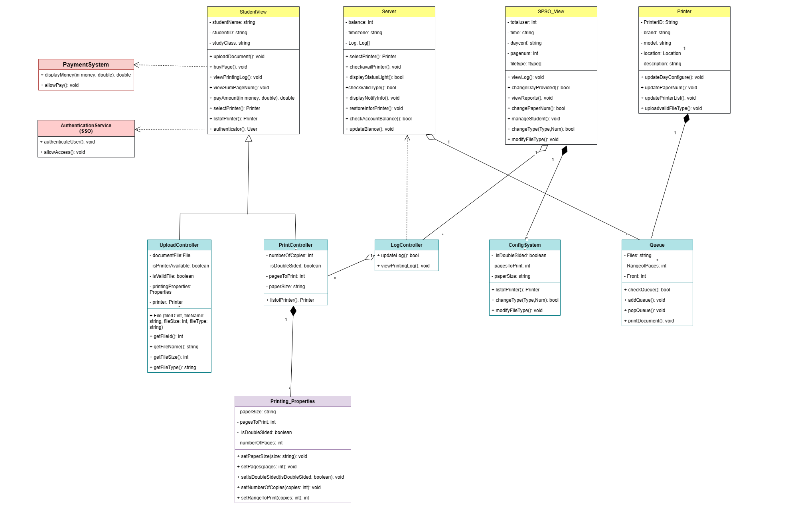
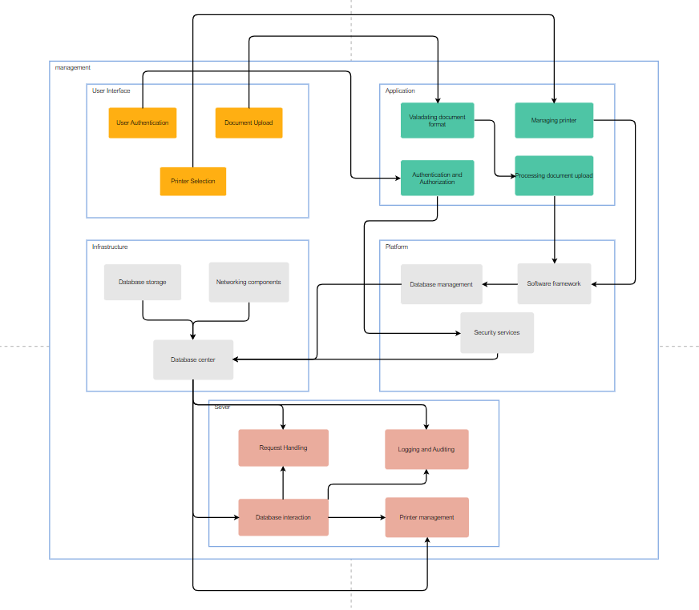

# BTL-CNPM
## Overview
The Student Smart Printing Service (HCMUT_SSPS) is a web-based application designed to provide a seamless printing experience for students within the campuses of Ho Chi Minh University of Technology. This system allows students to upload documents, choose printers, and specify printing properties, while also providing administrators with tools for configuration and monitoring.

***
## Stakeholders:   
- **Student**
   - End users of the HCMUT-SPSS
- **SPSO**
   - Configuring and managing the printing service 
   - Overseeing the printing history of students
- **Bkpay**
   - Managing online payments and checkouts for purchases beyond the default number of pages
   - BKPay can be integrated to link directly to students' bank accounts
- **Maintance System**
   - This system will switch to an alternative system when the current system is experiencing malfunctions, providing the maintenance team with the ability to repair issues
   - Upgrading and improving the printing system based on feedback from students or the SPSO
## Features
- **Print Document:**
  - Upload documents for printing
  - Select printer, paper size, and other printing properties
- **Logging:**
  - System logs printing actions, including student ID, printer ID, file name, start and end time, and the number of pages for each page size.
- **Student Account Management:**
  - Students are allocated a default number of A4-size pages per semester.
  - Students can purchase additional pages using an online payment system.
- **Administration:**
  - Student Printing Service Officer (SPSO) can manage printers (add/enable/disable).
  - SPSO can configure system settings such as default pages, permitted file types, etc.
- **Reports:**
  - Automatic generation of monthly and yearly reports on system usage.
  - SPSO can view printing history for all students or specific students and printers.
 
## Requiremens

- **Student**
  - **Login/Logout:** Capability for students to log in and log out of the system.
  - **Upload Documents:** Ability for students to upload documents (.pdf, .docx, .pptx, etc.) to the system.
  - **Select Printer:** Capability for students to choose a printer from the list of available printers. 
  - **View Printing history:** Students should have the ability to view the history of previously printed documents.
  - **Payment:** If the system requires payment, students should have the ability to make payments through the BKPay system.

- **SPSO**
  - **Printer Management:** Ability to add, edit, and delete printers within the system. Adjustment of the printer status, such as enabling or disabling. 
  - **Monitor Printing History:** View and generate reports on the printing history of all students and printers.
  - **System Configuration:** Adjust system settings such as the default number of printed pages, the dates for setting the default number of pages, accepted file formats, and printing prices.
  - **Access Reports:** Access reports on system usage, which are automatically generated at the end of each month and year, and stored in the system.
  - **Document Management:** SPSO can manage the system's document repository, both the general storage and individual student repositories.

- **Maintance system**
  - **Monitor Printer Status:** Check the operational status of all printers, including ink/paper levels, and other potential issues.
  - **Incident Management:** Receive and address incident reports, categorizing them based on priority levels.
  - **Software Updates:** Centrally update the system software and printer software.
  - **Access Control Management:** Adjust and assign access permissions within the system, allowing only authorized personnel to perform maintenance tasks. Additionally, the team is responsible for granting access permissions to students to use the system.
  - **Activity Reporting:** Generate and view reports on maintenance activities, including feedback response time, issue resolution time, and the status of printers.

- **BKpay** 
  - **Payment Transactions:** Provide the ability to securely and quickly execute payment transactions for printing services.
  - **Reports and Invoices:** Automatically generate reports and invoices after each successful transaction.
  - **Check Transaction Status:** Provide users and administrators with the ability to check the status of payment transactions.
  - **Notifications:** Send automatic notifications to users regarding the status of their transactions through email, SMS, or other means.

***

## System modelling
- **Activity Diagram**

 *Description:*
  - Student accesses the Print page after authenticating through the HCMUT-SSO system.
  - The system checks the availability of printers, signaling green lights for available printers and red lights for unavailable ones. The student uploads a document to the system. The system validates the uploaded document against the SPSO-approved list.
  - If the document is invalid, a warning notification is sent, and the user returns to the upload page. If the document is valid, the system displays a list of available printers.
  - After selecting a printer, the system records the printer information and proceeds to the user interface for print attribute design.The user designs print attributes and confirms the settings.
  - The system checks the user's paper balance. If the balance is insufficient, a warning screen is displayed, and the system returns to the upload page, clearing current information. If the balance is sufficient or surplus, the system sends a request to the print queue of the selected printer and waits for printing.
  - The selected printer starts printing and notifies the system upon completion.The system displays a success message and information about where to pick up the printed document. Information about the selected printer is logged, and the system deducts the corresponding number of paper units used from the user's account.

- **Sequence Diagram**

*Description*
   - *Object List:* Student, Server, Database, Printer, Queue.
   - *Student Action:* After using the print feature, the Server checks in the Database to see if any printers are still operational and sends a signal to notify the Student. The Student selects a document and uploads it to the Server.
   - *Server Validation:* The Server checks if the document conforms to the required format using predefined formats in the Database. If valid, it returns a printer selection screen for the Student; otherwise, it issues a warning.
  - *Printer Selection:* After the Student chooses a printer, the Server stores the selected printer's information and displays the print attribute selection screen for the Student.
  - *Attribute Confirmation:* Once the Student selects print attributes and confirms, the Server checks the paper balance in the Student's account. If there's enough paper, it initiates the printing process; otherwise, it displays a warning, cancels the printing process, and removes the uploaded document and selected printer information from the Database.
  - *Printing Process:* For the printing process, the Server adds the Student's document to the Queue. The Printer continuously checks the Queue. If the Queue is empty, it performs the Pop Queue action; otherwise, it repeatedly performs the Pop Queue action until the last step.
  - *Printing Completion:* After completing the printing, the Printer provides a notification, logs the print history information, and updates the paper balance in the Student's account.

- **Class Diagram**

*Description*
**(a) Class PaymentSystem:** Thể hiện việc thanh toán của sinh viên khi in ấn tài liệu
• *displayMoney()*: Hiển thị trên màn hình số tiền cần phải thanh toán
• *allowPay()*: Chấp nhận các hình thức thanh toán từ sinh viên
**(b) Class Authentication Service (SSO)**: Quản lí hệ thống
• *authenticateUser()*: Yêu cầu xác thực thông tin sinh viên thực hiện in ấn
• *allowAccess()*: Sau khi đã xác nhận, sinh viên truy cập thành công vào hệ thống
**(c) Class StudentView:** Thông tin sinh viên (Tên, MSSV, Lớp) và các thao tác với máy in
• *uploadDocument()*: Tải file cần in lên hệ thống
• *viewPrintingLog()*: Xem lịch sử truy cập và in ấn
• *payAmount*: Trả phí
• *authenticator()*: Đăng nhập và xác nhận thông tin sinh viên
• *selectPrinter()*: Lựa chọn máy in phù hợp để in
**(d) Class Server:** Máy chủ quản lí
• *checkAvailPrinter()*: Kiểm tra máy in ở trạng thái có thể sử dụng
• *checkValidType()*: Kiểm tra loại giấy có thể in
• *restoreInfoPrinter()*: Lưu lại các lần in của sinh viên
• *checkAccountBalance*: Kiểm tra số dư sau khi thanh toán
**(e) Class SPSO_View:** Dịch vụ quản lí in ấn, hiển thị các thông số như tổng lượng sinh viên truy cập, này in, số tờ, loại giáy,......
• *modifyFileType()*: Điều chỉnh loại file cần in
• *manageStudent()*: Quản lí thông tin sinh viên trên hệ thống in
• *viewReposts()*: Hiển thị nội dung của file cần in
**(f) Class Printer:** Thể hiện các thông tin của máy in như tên, nhãn hiệu, mã máy, một vài miêu tả về máy và vị trí đặt máy trong khuôn viên trường
• *updatePaperNum()*: Hiển thị số trang cần in
• *updatePrinterList()*: Hiển thị danh sách các máy in hiện có và có thể sử dụng
• *updateValidFileType*: Thông báo chấp nhận loại file được tải lên
**(g) Class UploadController:** Trình quản lí hoạt động tải file lên hệ thống, cung cấp các lựa chọn in trên màn hình, cho biết máy có thể in hay không, và file hợp lệ
• *getFileType()*: Lấy kiểu tài liệu được tải lên
• *getFileName()*: Lấy tên tài liệu
**(h) Class PrintController:** Trình quản lí máy in, giúp hệ thống kiểm tra các bản tài liệu in, in 1 hay 2 mặt, kích thước trang
• *listofPrinter()*: Lưu danh sách các máy in
**(i) Class LogController:** Trình quản lí lịch sử in của sinh viên
• *updateLog()*: Lưu và cập nhật các thời gian truy cập của sinh viên
• *viewPrintingLog()*: Hiển thị các lần in ấy
**(j) Class ConfigSystem:** Điểu chỉnh hoạt động in
• *changeType()*: Cho phép thay đổi loại tài liệu và số lượng giấy cần in
• *modifyFileType()*: Cho phép điểu chỉnh tài liệu
**(k) Class Queue:** Máy chủ sẽ dựa trên hoạt động tại các Printer để gợi ý người dùng một cách hợp lí các máy in phù hợp
• *checkQueue*: Kiểm tra hàng chờ các máy in cần dùng
• *addQueue*: Thêm máy in đang trống vào hàng đợi
• *popQueue*: Không hiển thị máy in đang được sử dụng
**(l) Class Printing_Properties:** Hiển thị thông số của hoạt động in ấn như kích thước trang, số tờ, in 1 hay 2 mặt
• *setPaperSize()*: Thiết lập kích thước cần in
• *setIsDoubleSided()*: Lựa chọn in 1 hay 2 mặt
• *setNumberOfCopies()*: Lập số lượng tài liệu cần in

---
## Architecture - Layered Architecture

- ***Description: Login***
1, Client Layer: The process begins when a student accesses the printing service through the client layer, which provides a login interface. The student enters their credentials (e.g., username and password) to initiate the authentication process.
2, Application Layer: The client layer sends the entered credentials to the application layer for authentication. The application layer, in turn, verifies these credentials against stored user data in the system's database. If the credentials are valid, the application layer proceeds to the next steps. Otherwise, an authentication failure message is sent back to the client layer.
3, Platform Layer: The platform layer provides underlying services such as encryption and secure communication, ensuring that the authentication process is secure and protecting user credentials during transmission between the client and application layers.
4, Infrastructure Layer: The infrastructure layer, which includes servers and networking components, facilitates the communication between the client and application layers. It ensures that the authentication request is properly routed to the appropriate server handling the application logic.
5, Server Layer: Within the server layer, the authentication logic is implemented. This involves checking the entered credentials against the user database. If the credentials are valid, the server layer generates an authentication token or session identifier and associates it with the user's session. This token is then sent back to the client layer.
6, Client Layer (Post-Authentication): The client layer receives the authentication token from the server layer. Subsequent requests from the client to the server include this token, serving as proof of the user's authenticated status. The client layer stores this token securely (e.g., in cookies or local storage) to maintain the user's session.

- ***Description: Upload document***

1, Client Layer: The user, a student in this case, interacts with the client layer to upload a document. The client layer provides a user-friendly interface for selecting a document file from the user's device and initiating the upload process.
2, Application Layer: The client layer sends the document upload request to the application layer. The application layer, upon receiving the request, validates the document format to ensure it complies with the permitted file types configured by the Student Printing Service Officer (SPSO).
3, Platform Layer: The platform layer supports the uploading process by managing the necessary tools and services. This may involve utilizing middleware services for handling file uploads and ensuring data integrity.
4, Infrastructure Layer: The infrastructure layer, consisting of servers and networking components, facilitates the secure and efficient transfer of the document from the client to the application layer. It ensures that the document is received without corruption.
5, Server Layer: Within the server layer, the application logic processes the uploaded document. If the document format is valid, the server layer stores the document in the system's database, associating it with the user who initiated the upload. If the document is invalid, an error message is sent back to the client layer.
6, Client Layer (Post-Upload): The client layer receives the response from the server layer. If the upload is successful, the client layer may display a confirmation message to the user. If there's an error, the client layer can present an appropriate error message for the user to address the issue.